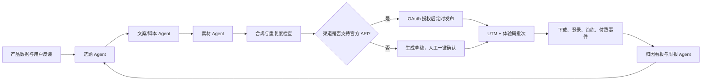

# offerGet 自动化推广作战计划

## 目标与边界

目标是在不制造垃圾营销、不使用“作弊/规避监控”等高风险表述的前提下，把 **内容生产 → 渠道分发 → 下载 → 登录 → 开始练习 → 购买** 做成可观测的自动化闭环。

自动化不是无人值守群发。所有公开内容必须先经过合规规则检查；不具备官方发布 API 的平台仅自动生成草稿，不模拟人工点击或绕过平台限制。

## 一、30 天目标

| 指标 | 30 天目标 | 数据来源 |
| --- | ---: | --- |
| 有效下载 | 1,000 | 下载链接 UTM |
| QQ 邮箱登录 | 350 | 注册归因字段 |
| 完成首场练习 | 180 | 练习会话事件 |
| 体验码兑换 | 100 | 体验码批次 |
| 付费订单 | 40 | 订单与支付回调 |
| 内容发布 | 30 条图文 / 12 条短视频 | 内容队列 |

先以“首场练习完成率”和“下载到登录率”判断产品信息是否准确；付费转化放在第二优先级，避免一开始只做促销。

## 二、渠道与自动化程度

| 渠道 | 内容形式 | 自动化程度 | 发布方式 |
| --- | --- | --- | --- |
| 抖音 | 30–60 秒演示视频、图文 | 高 | 申请开放平台、帐号 OAuth 授权后通过官方发布 API |
| 今日头条 | 视频、延展图文 | 高 | 同一授权体系下同步分发 |
| 公众号 | 深度文章、活动通知 | 中 | 自动生成草稿，运营确认后群发 |
| 小红书 | 图文卡片、经验帖 | 中 | 自动生成图文与标题，人工确认发布到草稿箱 |
| 知乎 | 问答、经验复盘 | 中 | 自动生成候选回答，人工确认发布 |
| 官网 SEO | 落地页、FAQ、使用指南 | 高 | 从审核通过的内容自动生成静态页面并部署 |
| 邮件 | 新用户引导、召回 | 高（需用户同意） | 定时任务；必须支持退订 |

抖音官方内容发布能力要求应用权限与帐号 OAuth 授权；其图片/视频发布会经过平台审核，带明显品牌水印可能影响分发，因此素材采用干净的产品演示画面和自然文案。 [抖音官方发布方案](https://open.douyin.com/platform/resource/docs/ability/content-management/douyin-publish-solution/)

## 三、自动化增长系统

### 1. 内容工厂（每日自动运行）

输入：用户问题、客服问题、搜索词、后台转化数据、已发内容表现。

输出：

- 3 个短视频脚本：开头 3 秒钩子、镜头列表、字幕、标题、话题；
- 5 篇图文：小红书/公众号/知乎各自改写，不直接复制；
- 1 篇官网 SEO FAQ 或指南；
- 3 套体验码批次名，如 `DY-ALG-20260730-A`，用于渠道归因；
- 统一的下载链接：`?utm_source=...&utm_campaign=...`。

### 2. 合规检查器（发布前强制）

拒绝并重写包含以下导向的内容：

- 考试作弊、代考、规避监考、绕过检测、隐身通过面试；
- “保证拿 offer”“保证通过”等结果承诺；
- 虚假案例、虚假价格、未接通的支付能力；
- 未经授权的客户截图、录音、面试题或个人信息。

固定产品定位：**个人模拟面试、表达练习、知识复盘和学习辅助**。演示使用模拟题和虚构用户数据。

### 3. 自动分发器

- 仅保存 OAuth token 的加密引用；Client Secret 与刷新 token 只在服务器环境变量中保存。
- 每个帐号配置频率上限、发布时间窗、素材去重指纹和失败重试。
- 抖音/头条在授权后走官方 API；无官方 API 的渠道只创建“待发布草稿”。
- 所有发布都记录 `content_id / channel / UTM / 体验码批次 / 发布时间 / 审核状态`。

### 4. 自动触达（站内与邮件）

前提：注册页新增营销订阅开关、隐私说明和退订入口。

| 触发时机 | 人群 | 自动内容 | 停止条件 |
| --- | --- | --- | --- |
| D0 注册后 | 未开始练习 | 60 秒开始练习指引 | 已开始练习 |
| D1 | 已开始但未完成 | 场景选择与复盘建议 | 完成首场 |
| D3 | 已完成试用 | 次卡权益说明与体验码入口 | 已购买或退订 |
| D7 | 沉默用户 | 新场景/练习清单 | 已回访或退订 |

不发送“强促销连环邮件”；同一用户每周最多 2 封营销邮件。

## 四、第一批内容矩阵

1. **算法面试**：`不会算法题时，先把这 3 层思路说清楚`；演示“题目拆解 → 边界条件 → 代码框架”。
2. **英语表达**：`英语机试卡住时，如何把听到的问题整理成可回答的要点`；演示英语场景与语音转录。
3. **通用面试**：`自我介绍不是背简历：一个 60 秒结构`；演示通用问答场景。
4. **复盘方法**：`一场模拟面试结束后，复盘这 4 件事`；引导开始练习。
5. **产品演示**：真实录屏展示快捷键、场景切换、连续追问；全程使用模拟题。

每个主题至少生成 3 个开头版本，7 天后按首屏停留、下载和首练率淘汰。

## 五、需要补建的产品能力

后台一期已有体验码批次和订单基础。要实现自动增长闭环，下一期需新增：

1. **归因字段**：下载链接 `utm_source / utm_campaign / utm_content` 写入注册用户和订单。
2. **事件表**：下载、注册、登录、首练、语音开启、体验码兑换、订单创建、支付成功。
3. **增长看板**：按渠道/批次查看漏斗、激活率、付费率、留存和模型成本。
4. **内容库**：选题、素材、文案版本、审核状态、发布记录、链接和数据回流。
5. **授权中心**：抖音 OAuth、公众号凭证、邮件订阅；密钥只在服务器保存。
6. **工作流调度**：每日选题、每周报告、素材生成、定时发布/草稿、异常告警。

## 六、实施顺序

### 第 1 周：可归因

- 给官网下载链接补 UTM；
- 创建渠道体验码批次；
- 新增增长事件和后台漏斗；
- 发布 10 条经过人工确认的内容，作为基准数据。

### 第 2 周：内容自动化

- 部署内容 Agent、合规检查器、素材模板和草稿队列；
- 自动产出 7 天内容日历；
- 接入邮件订阅/退订和 D0–D7 引导。

### 第 3–4 周：官方 API 分发与优化

- 申请抖音开放平台发布权限并完成 OAuth；
- 将已审核素材定时自动发布；
- 每周由分析 Agent 输出“继续/暂停/改写”建议；
- 把高转化主题扩写为官网 SEO 页面与短视频系列。

## 七、需要你提供的账号与凭证

开始技术实现前，需要你在服务器环境变量或授权页中提供：

- 抖音开放平台 `Client Key / Client Secret`，并完成运营帐号 OAuth；
- 公众号 AppID/AppSecret（若要自动草稿/通知）；
- 发送营销邮件的独立发信身份与退订域名；
- 内容发布帐号与品牌素材；
- 允许使用的真实案例范围。

不要在聊天里直接发送任何 Secret；后续我会提供后台配置页或服务器环境变量清单。
