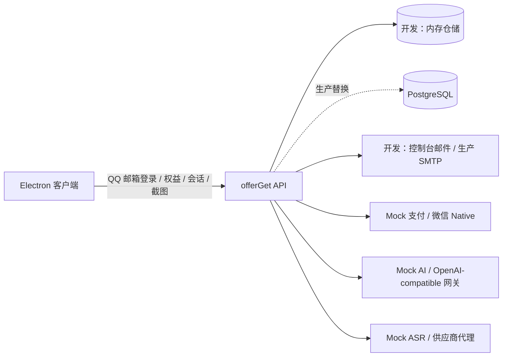

# offerGet P0 技术实施方案

## 1. 评审结论与范围冻结

本方案由产品/UX、后端安全、QA/运营三方评审后冻结。P0 交付的是可本地联调的完整闭环：QQ 邮箱登录、服务端权益、练习会话、模拟支付发卡和服务端 AI 网关。

| 决策 | P0 结论 |
| --- | --- |
| 登录 | 仅 `@qq.com` 邮箱验证码；客户端不保存验证码或第三方密钥 |
| 截图试用 | 每账号仅一次，点击确认后连续 45 分钟 |
| 语音试用 | 每账号 3 次、每次 15 分钟；仅可在活跃练习会话中启动 |
| 会话卡 | ¥9.90 1 次，购买后 30 天内激活；¥88 10 次，购买后 90 天内使用；每次启动后连续 60 分钟 |
| 启动规则 | 用户主动启动才扣一次；停止不暂停、不返还；一账号仅一个活跃会话 |
| 支付 | 本地使用 `mock` 支付提供方；生产自动发卡只允许微信 Native 动态订单和签名通知；静态收款码只支持人工审核发卡 |
| 模型密钥 | 仅后端环境变量/密钥服务保存；客户端只调用 offerGet API |
| UI 定位 | 仅限模拟练习与复盘；移除本地 BYOK、考试/规避检测相关入口和文案 |

## 2. 实施架构

后端采用独立 TypeScript/Fastify 服务。开发模式以可重置的内存仓储与 Mock 适配器完成端到端测试；生产替换为 PostgreSQL、Redis、SMTP、微信 Native 与真实模型/ASR 适配器，接口与业务状态机保持不变。

## 3. 共享 API 契约

所有受保护接口使用 `Authorization: Bearer <accessToken>`；所有创建/扣减类请求带 `Idempotency-Key`。金额一律使用分。

| 接口 | 请求 | 成功响应 / 要点 |
| --- | --- | --- |
| `POST /v1/auth/send-email-code` | `{ email }` | 仅 QQ 邮箱；开发模式返回 `devCode`；60 秒冷却、5 分钟失效 |
| `POST /v1/auth/verify-email-code` | `{ email, code }` | `{ accessToken, refreshToken, user }` |
| `POST /v1/auth/refresh` | `{ refreshToken }` | 轮换 access token |
| `GET /v1/me/entitlements` | — | 用户、试用状态、次卡、活跃会话、服务器时间 |
| `POST /v1/practice-sessions/start` | `{}` | 优先启动未使用截图试用，否则原子扣可用次卡；返回会话 |
| `POST /v1/practice-sessions/:id/stop` | — | 结束活跃会话，不退权益 |
| `POST /v1/asr-trials/start` | `{ sessionId }` | 在非付费活跃会话中扣减 1 次语音试用；返回 15 分钟语音会话 |
| `POST /v1/checkout-sessions` | `{ productCode }` | 锁定 ¥990/¥8800，返回订单与 mock/微信二维码数据 |
| `GET /v1/orders/:orderNo` | — | 返回订单与发卡结果；查询不改变权益 |
| `POST /v1/dev/orders/:orderNo/mark-paid` | — | 仅开发环境：模拟可信支付通知，走同一幂等发卡逻辑 |
| `POST /v1/ai/screenshot` | `{ sessionId, requestId, image }` | 校验未到期练习会话后调用 AI 适配器 |

统一错误码：`AUTH_REQUIRED`、`INVALID_EMAIL`、`CODE_EXPIRED`、`RATE_LIMITED`、`NO_ACTIVE_SESSION`、`SESSION_EXPIRED`、`NO_ENTITLEMENT`、`ORDER_NOT_FOUND`、`PAYMENT_NOT_CONFIRMED`。

## 4. 客户端改造

- 增加登录页、账户权益面板、开始练习确认、会话倒计时、购买弹窗和订单状态。
- 未登录时禁止截屏、语音、购买和快捷键触发；登录后从服务端刷新权益。
- 移除 API Base URL、模型 API Key、模型选择、百炼 API Key 和相关前置弹窗。
- 将主进程的 AI 调用改为 `POST /v1/ai/screenshot`；开发期使用 Mock AI 返回固定练习建议。
- 令牌仅保存在主进程内存/安全存储；渲染层只拥有展示状态。会话到期、接口拒绝或断线时立即停止采集并刷新权益。

## 5. 后端业务不变量

- 邮箱规范化、验证码哈希和验证次数均由后端处理；`lower(email)` 唯一。
- 一次 45 分钟试用仅能创建一次；语音试用在创建时原子扣减。
- 启动付费会话时，“扣一次 + 创建会话”必须原子完成；同账户并发启动最多成功一个。
- 订单商品和金额只在服务器商品目录定义；客户端不传价格。
- 发卡只能由支付提供方可信事件触发，事件幂等；客户端刷新、深链或按钮不可发卡。
- 所有截图请求先检查会话时间；到期后立即拒绝。

## 6. 联调验收

1. QQ 邮箱限制、验证码过期/重放/频率限制。
2. 新用户首次启动仅创建一条 45 分钟截图会话。
3. 语音试用连续启动 3 次后拒绝第 4 次；每次创建即扣减。
4. 1 次卡/10 次卡在 mock 支付确认后分别发 1/10 次；重复确认只发一次。
5. 付款不计时；启动会话才扣次；余额为 1 的并发启动只成功一次。
6. 截图 API 在未登录、伪造会话、会话到期三种情况均拒绝。
7. Electron 登录 → 领取试用 → 模拟支付 → 发卡 → 启动 60 分钟会话 → 截图请求全链路通过。
8. 代码与日志不得含模型/语音/邮件/支付密钥、验证码和原始截图数据。

## 7. 真实上线前替换清单

- 内存仓储替换 PostgreSQL 事务仓储，限流/会话锁接入 Redis。
- 控制台邮件替换具备 SPF/DKIM/DMARC 的 SMTP 发送服务。
- `mock` 支付替换微信 Native 动态订单、验签通知、查单、退款和每日对账。
- Mock AI/ASR 替换服务端供应商代理，密钥进入 Secret Manager 并配置限额告警。
- 补齐隐私政策、服务协议、退款规则、客服/投诉入口及生产监控。
