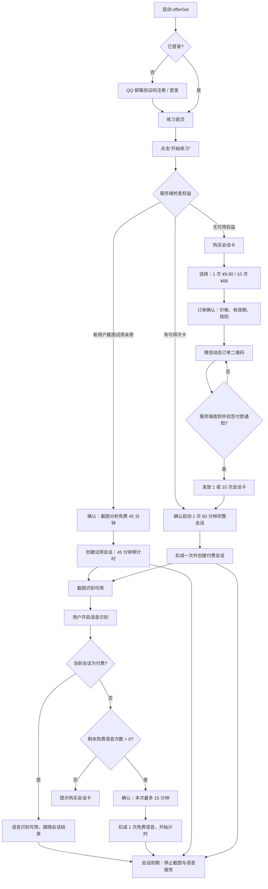
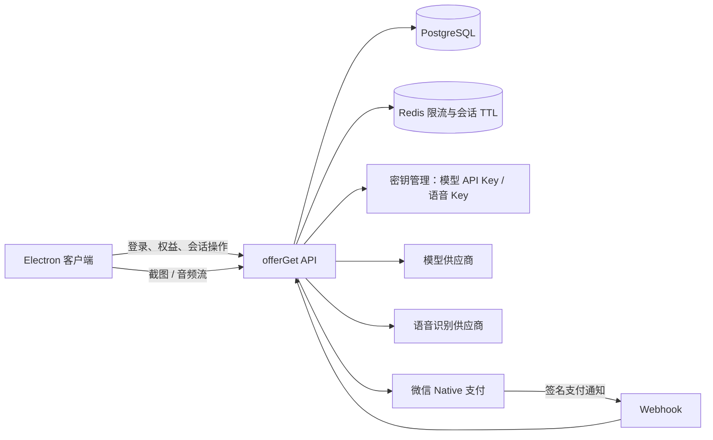

# offerGet 会话次卡：产品交互与技术方案

## 0. 产品边界

本方案将功能定义为**模拟面试、练习与复盘**服务。用户注册、购买、使用时均绑定可恢复账号；首期仅支持已验证的 `@qq.com` 邮箱验证码登录。服务端而非客户端决定是否可调用截图分析和语音识别。

> 重要：普通“固定收款码”无法将一笔微信付款可靠关联到用户、商品和金额，也不会提供可自动开通权益的可信回调。要自动发卡，必须接入微信商户的 Native 扫码支付/订单通知；若当前只有静态收款码，首期只能由运营人工核验流水后发卡，不应自动开通。

## 1. 产品交互图

### 关键界面与文案

| 页面/状态 | 主要内容 | 主操作 |
| --- | --- | --- |
| 注册登录 | 仅输入 `@qq.com` 邮箱并填写验证码；说明登录后可使用练习功能 | 获取验证码 / 登录 |
| 练习首页 | 当前权益、语音试用剩余次数、可用次卡、最近订单 | 开始练习 |
| 试用确认 | “截图分析免费 45 分钟；开始后连续计时” | 开始试用 |
| 付费会话确认 | “将使用 1 次，完整功能可用 60 分钟” | 启动会话 |
| 购买页 | 1 次卡 ¥9.90、10 次卡 ¥88；未激活有效期与退款规则 | 去支付 |
| 收银台 | 商品、订单号、微信动态二维码、15 分钟倒计时、刷新状态 | 已完成付款 / 取消 |
| 活跃会话条 | 截图/语音状态、剩余时间、停止按钮 | 停止练习 |
| 到期页 | “本次会话已结束”，保留历史记录和购买入口 | 购买次卡 |

## 2. 权益与计费规则

### 新用户权益

| 权益 | 资格 | 启动时机 | 限制 |
| --- | --- | --- | --- |
| 截图分析试用 | 每个新账号 1 次 | 用户首次点击“开始练习”并确认 | 连续 45 分钟；到期立即停止服务端截图分析 |
| 语音识别试用 | 每个新账号 3 次 | 每次首次点击“开启语音识别”并确认 | 每次最多 15 分钟；不可拆分、不可暂停后续用 |

免费截图试用与免费语音试用是两本独立账。用户可在 45 分钟截图试用期间启用一次 15 分钟语音试用；剩余语音试用可在后续允许的练习会话中使用。

### 售卖商品

| 商品 | 价格 | 获得权益 | 启动与有效期 |
| --- | ---: | --- | --- |
| 1 次卡 | ¥9.90 | 1 个完整练习会话 | 用户主动启动后连续 60 分钟内，截图分析 + 语音识别不限次数；未启动卡建议 30 天有效 |
| 10 次卡 | ¥88.00 | 10 个完整练习会话 | 每次主动启动消耗 1 次，每次连续 60 分钟；未用次数建议自购买起 90 天有效 |

规则必须明确：付款后**不自动开始计时**；只在用户点击“启动会话”时扣减一次。开始后不能暂停、不能转赠，且同一账号同一时刻只允许 1 个活跃会话。所谓“不限使用”仅指该会话内的截图与语音功能，不解除并发、速率和合理使用限制。

## 3. 服务端技术方案

### 3.1 模型密钥与调用

- 模型 API Key 和语音识别 Key 只保存在服务端环境变量/密钥管理服务中；禁止写入 Electron、预加载脚本、Zustand、日志或 `.env` 打包产物。
- 客户端改为调用 `offerGet API`，后端先校验用户、活跃会话和额度，再调用模型/语音供应商。
- 截图和音频只在完成推理所需时间内处理中转；记录最小化的用量审计，不将原始截图、音频和完整模型响应写入订单日志。

### 3.2 QQ 邮箱认证

- 客户端只提供 QQ 邮箱输入框；服务端将地址去空格、转小写后，使用 `^[a-z0-9._%+-]+@qq\.com$`（不区分大小写）校验。`foxmail.com`、企业邮箱和其他域名首期均不支持。
- `POST /v1/auth/send-email-code` 生成加密安全的 6 位验证码；只保存验证码哈希，5 分钟过期，验证成功后立即作废。
- `POST /v1/auth/verify-email-code` 在验证码通过后创建或登录 `users` 记录，并签发 offerGet 的 access/refresh token。
- 发送频率：同一邮箱 60 秒 1 次、24 小时最多 5 次；同 IP 10 分钟最多 10 次。发送和验证接口均接入图形/滑块验证码与审计日志。
- QQ 邮箱只能作为账号身份，不能单独阻止同一人注册多个 QQ 号；免费权益发放仍要结合随机安装 ID、IP 限流、异常行为识别和人工复核。不得采集硬件序列号等不必要设备信息。

### 3.3 最小数据模型

| 表 | 关键字段 | 说明 |
| --- | --- | --- |
| `users` | `id`, `email`, `email_verified_at`, `status` | 用户身份；`lower(email)` 唯一且仅允许 QQ 邮箱 |
| `email_verification_codes` | `email`, `purpose`, `code_hash`, `expires_at`, `attempts` | 验证码短期存储；也可改由 Redis 实现 |
| `trial_entitlements` | `user_id`, `screenshot_trial_used_at`, `asr_trial_remaining` | 新用户免费权益；语音初始为 3 |
| `session_passes` | `id`, `user_id`, `product_code`, `uses_remaining`, `expires_at`, `source_order_id` | 购买的次卡；1 次或 10 次 |
| `practice_sessions` | `id`, `user_id`, `kind`, `starts_at`, `ends_at`, `status`, `pass_id` | `trial_screenshot` 或 `paid_full`；服务端时钟决定结束时间 |
| `asr_trial_sessions` | `id`, `user_id`, `starts_at`, `ends_at`, `status` | 每条最多 15 分钟；创建时原子扣减一次 |
| `orders` | `order_no`, `user_id`, `product_code`, `amount_fen`, `status`, `expires_at` | 服务端锁价，金额用分保存 |
| `payment_events` | `provider`, `event_id`, `verified_at`, `processed_at` | Webhook 验签与去重 |
| `usage_events` | `user_id`, `session_id`, `type`, `request_id`, `occurred_at` | 截图/语音调用审计与风控 |

### 3.4 核心 API

| 方法 | 路径 | 服务端行为 |
| --- | --- | --- |
| `POST` | `/v1/auth/send-email-code` | 仅向 `@qq.com` 地址发送验证码 |
| `POST` | `/v1/auth/verify-email-code` | 注册/登录并签发令牌 |
| `GET` | `/v1/me/entitlements` | 返回试用状态、次卡余额、活跃会话和到期时间 |
| `POST` | `/v1/practice-sessions/start` | 原子检查并启动免费 45 分钟或扣减 1 次卡 |
| `POST` | `/v1/practice-sessions/{id}/stop` | 用户提前结束，不返还已启动次卡 |
| `POST` | `/v1/asr-trials/start` | 校验活跃会话与剩余次数，创建 15 分钟语音试用 |
| `POST` | `/v1/checkout-sessions` | 用商品编码创建订单和微信动态二维码 |
| `GET` | `/v1/orders/{orderNo}` | 客户端轮询订单最终状态 |
| `POST` | `/internal/wechat/webhook` | 验签、去重、支付确认后幂等发卡 |
| `POST` | `/v1/ai/screenshot` | 校验会话后代理模型截图分析 |
| `WS` | `/v1/asr/stream` | 校验会话后代理语音流；服务端到时强制关闭 |

### 3.5 一致性与防刷

- “启动会话”使用数据库事务：锁定可用 `session_passes` 行，`uses_remaining - 1` 与新会话写入必须同时成功。
- Redis 只做快速 TTL、并发锁和速率限制；PostgreSQL 是权益与计费真相来源。
- 微信通知必须验签、校验商户号/订单号/金额、以 `event_id` 去重；只以通知或主动渠道查询结果发卡，绝不以客户端“已付款”按钮发卡。
- 一账号一活跃会话、一账号一条实时语音流；截图、语音请求按账号/IP/设备限流，异常频率进入人工复核。
- 支付二维码需要动态订单；静态收款码仅可作为人工核验的临时兜底，不能承诺自动开通。

## 4. Electron 改造边界

1. 删除/隐藏客户端的模型 API Key、Base URL 和百炼 Key 配置；改为登录与“账户/会话卡”入口。
2. 应用启动后调用 `/v1/me/entitlements`；未登录仅可浏览说明，不能触发截图/语音 API。
3. `开始练习` 先调用会话启动 API，返回的 `sessionId` 附在每一次截图/音频请求中。
4. 将当前直接调用模型的 `src/main/ai.ts` 改为调用后端；音频由客户端通过受认证的 WebSocket 发送到后端代理。
5. 在 Coder 页显示服务端下发的剩余时长；到期事件、接口 403 或 WebSocket 关闭时立即停止 UI 与本地音频采集。
6. 购买页使用受控 HTTPS 收银台或服务端 QR；订单轮询只刷新权益，不能自行改写本地状态。

## 5. 需要产品负责人确认的事项

- 未激活 1 次卡和 10 次卡的有效期是否采用建议的 30 天/90 天。
- 付费会话是否允许使用高成本模型；如允许，须按模型成本增加“合理使用”上限与限流阈值。
- 微信商户是否已开通 Native 扫码支付与支付结果通知；若仅有静态收款码，是否接受人工发卡过渡。
- 语音试用剩余次数能否在没有截图权益时使用；本方案默认需要存在活跃练习会话，以免语音被独立滥用。
