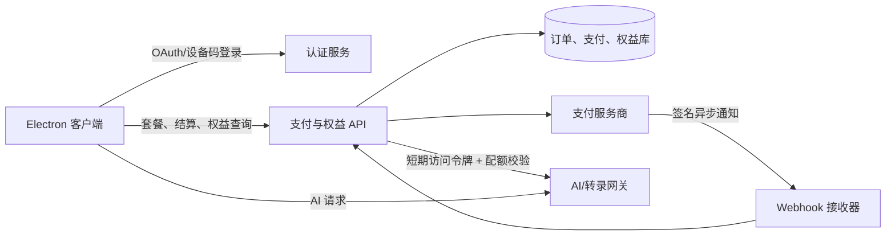
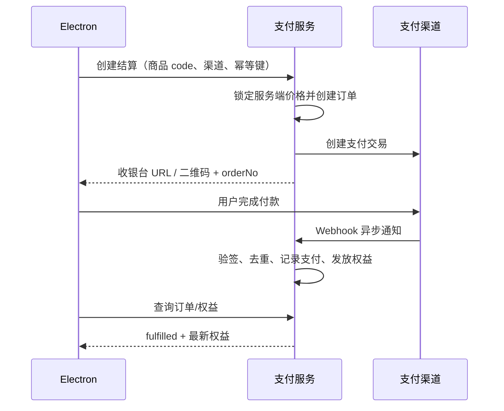

# 支付能力设计

## 1. 结论与范围

本项目目前是纯 Electron 客户端：没有账号、服务端、订单或权益系统。因此，支付能力必须由一个独立的**支付与权益服务**承接；客户端只负责登录、展示套餐、发起结算和读取权益，绝不保存商户私钥、支付渠道密钥或以客户端回跳作为支付成功依据。

建议先落地中国大陆桌面端 MVP：微信支付扫码 + 支付宝扫码、订阅型会员（按月/按年）和一次性加油包（可选）。付款在系统浏览器或扫码页完成，用户回到应用后由客户端轮询权益状态。后端以支付渠道异步通知为唯一的资金事实来源。

本文不包含支付渠道的商户开户、税务、发票及隐私合规配置；这些须由实际经营主体与法务/财务确认。仓库当前为 `CC BY-NC 4.0`，在商业收费或分发前还需要获得原作者商业授权。

## 2. 产品模型

### 2.1 推荐首期套餐

| 商品 | 计费方式 | 权益 | 适用目的 |
| --- | --- | --- | --- |
| 体验版 | 免费 | 有限次数或有限额度 | 降低首次使用门槛 |
| Pro 月卡 | 自动续费以后再启用；首期可手动续费 | 高额度模型调用、语音转录额度、优先支持 | 主力订阅商品 |
| Pro 年卡 | 一次支付 12 个月 | 与月卡相同，折扣价 | 提升回款和留存 |
| 加油包（可选） | 一次性 | 单独的调用/转录额度，设置有效期 | 覆盖低频用户和超额使用 |

首期只上线“固定期限会员 + 手动续费”，避免在桌面端第一版处理代扣签约、退款抵扣和续费失败等额外复杂度。自动续费应作为第二阶段能力。

### 2.2 权益定义

权益不应只用 `isPro` 布尔值表达。服务端按 `feature + limit + period` 管理，例如：

```json
{
  "planCode": "pro_month",
  "status": "active",
  "expiresAt": "2026-08-28T12:00:00Z",
  "features": {
    "ai_requests": { "limit": 300, "used": 42, "period": "monthly" },
    "transcription_minutes": { "limit": 600, "used": 31, "period": "monthly" },
    "advanced_models": { "enabled": true }
  }
}
```

模型调用和转录本身最终也必须由服务端代理或由服务端签发短期凭证，才能可靠地执行额度；仅在 Electron 内限制按钮无法防绕过。

## 3. 总体架构



建议将 `支付与权益 API`、Webhook 和 AI/转录网关部署在同一后端项目的不同模块中，并使用 PostgreSQL。首期不需要微服务拆分；关键是信任边界清晰。

### 关键原则

- 所有金额用分（`amountFen: integer`）保存和计算，客户端不传最终价格。
- 商品价格、优惠和可售状态只能由服务端的商品目录决定。
- Webhook 必须先验签、再落库、后处理；通知可重复、乱序、延迟到达。
- 每个写操作要求 `Idempotency-Key`；订单、支付通知和权益发放均须幂等。
- 客户端支付成功页面、轮询结果和同步跳转只用于体验，不用于开通权益。
- 商户密钥、渠道证书、Webhook 验签密钥仅存在服务端密钥管理系统。

## 4. 数据模型

| 表 | 关键字段 | 说明 |
| --- | --- | --- |
| `users` | `id`, `email/phone`, `status` | 账号主体；首期可使用邮箱验证码或 OAuth 登录 |
| `devices` | `id`, `user_id`, `device_fingerprint`, `revoked_at` | 可选设备上限与异常登出 |
| `products` | `code`, `type`, `price_fen`, `currency`, `active` | 服务端商品目录，价格版本不可覆盖历史 |
| `orders` | `id`, `order_no`, `user_id`, `product_code`, `amount_fen`, `status`, `expires_at` | 业务订单；`order_no` 全局唯一 |
| `payment_attempts` | `id`, `order_id`, `provider`, `provider_trade_no`, `status`, `raw_result` | 一个订单可多次尝试支付；渠道单号唯一 |
| `payment_events` | `provider`, `event_id`, `payload`, `verified_at`, `processed_at` | 原始通知审计与去重；`provider + event_id` 唯一 |
| `entitlements` | `user_id`, `feature`, `status`, `starts_at`, `ends_at`, `source_order_id` | 权益账本；以记录而非覆写状态保存 |
| `usage_ledger` | `user_id`, `feature`, `quantity`, `request_id`, `occurred_at` | 用量扣减，可追溯、可补偿 |
| `refunds` | `id`, `order_id`, `amount_fen`, `status`, `provider_refund_no` | 退款与权益回收的依据 |

推荐订单状态：`created → pending_payment → paid → fulfilled`；终态为 `expired`、`cancelled`、`refunded`、`partially_refunded`。支付状态和订单状态分开保存，避免“支付已成功但权益发放重试中”被误判为失败。

## 5. 核心流程

### 5.1 购买与开通

1. 客户端要求用户登录，拉取 `/v1/catalog` 和 `/v1/me/entitlements`。
2. 客户端以商品 `code`、支付渠道和 `Idempotency-Key` 调用创建结算接口。
3. 后端重新读取商品价格，创建短时有效订单和支付尝试，向渠道创建二维码/收银台会话。
4. 客户端调用 Electron `shell.openExternal()` 打开 HTTPS 收银台，或展示后端返回的二维码；不在渲染进程加载不受控支付页面。
5. 渠道异步通知 Webhook；后端验签和去重后，将订单标记为已支付，并在同一事务/Outbox 中写入“发放权益”任务。
6. 权益任务幂等地写入/延长权益，订单变为 `fulfilled`。
7. 客户端每 3 秒轮询订单或使用推送刷新权益；检测到 `fulfilled` 后展示成功状态。



### 5.2 退款与争议

- 退款由运营后台发起，后端调用支付渠道退款接口；渠道退款通知或主动查询确认后，再写入退款状态。
- 全额退款：立即撤销未消耗权益；已消耗额度按明确的退款政策计算。部分退款按退款单记录处理，禁止直接改原订单金额。
- 拒付、风控和人工冻结应将账号置为 `restricted`，网关即时拒绝受限功能，并保留审计记录。

## 6. API 合约（MVP）

所有 API 使用 HTTPS、Bearer 访问令牌和 JSON；金额字段为整数分。写接口要求 `Idempotency-Key` 请求头，建议保存 24 小时以上。

| 方法 | 路径 | 用途 |
| --- | --- | --- |
| `GET` | `/v1/catalog` | 可售商品和展示价格 |
| `GET` | `/v1/me/entitlements` | 当前权益、到期和用量 |
| `POST` | `/v1/checkout-sessions` | 创建订单并返回收银台地址/二维码 |
| `GET` | `/v1/orders/{orderNo}` | 查询订单最终状态 |
| `POST` | `/v1/orders/{orderNo}/cancel` | 取消未支付订单（可选） |
| `POST` | `/v1/auth/device/start` | 创建设备登录会话 |
| `POST` | `/v1/auth/device/poll` | 轮询设备授权结果 |
| `POST` | `/internal/payments/{provider}/webhook` | 仅供支付渠道调用 |

创建结算请求示例：

```json
{ "productCode": "pro_month", "provider": "wechat_qr" }
```

响应示例：

```json
{
  "orderNo": "P202607280001",
  "status": "pending_payment",
  "expiresAt": "2026-07-28T10:15:00Z",
  "checkoutUrl": "https://pay.example.com/checkout/…",
  "qrCodeUrl": "https://pay.example.com/qrcodes/…"
}
```

## 7. Electron 接入设计

首期只新增一个“账户与套餐”页面，不改动现有设置中的用户自带 API Key 流程。后续若售卖平台代理模型额度，再将 AI 请求改为访问 AI 网关。

| 位置 | 修改 |
| --- | --- |
| `src/renderer/src/App.tsx` | 新增 `/billing` 路由，并在应用启动时刷新权益 |
| `src/renderer/src/coder/AppHeader.tsx` | 增加套餐入口，位于设置/帮助旁 |
| `src/renderer/src/billing/` | `BillingPage`、`PlanCard`、`CheckoutDialog`、`OrderStatus` 组件 |
| `src/renderer/src/lib/store/billing.ts` | 登录态、权益、结算中订单；访问令牌仅保存在 Electron 安全存储/系统钥匙串 |
| `src/preload/index.ts` | 仅暴露受控的 `openExternal(url)`、安全存储与深链事件；不向渲染进程暴露支付密钥 |
| `src/main/` | 处理自定义协议回跳（仅作刷新触发）、外部 URL 白名单、令牌安全存储 |

支付完成回跳建议为 `interview-coder://payment-complete?order_no=…`，但必须只把它当作“刷新该订单”的信号。主进程校验协议、主机和参数格式后再通知渲染进程，渲染进程从服务端读取最终状态。

## 8. 安全、可靠性与观测

- 认证：设备码/OAuth 登录，短期 access token + 可撤销 refresh token；多设备使用服务端设备记录控制。
- Webhook：按渠道规范验签，记录原文哈希和事件 ID；先持久化后 ACK；失败重试与死信队列。
- 幂等：订单创建按用户、商品、幂等键去重；权益发放按 `source_order_id + feature` 唯一；用量按 `request_id` 唯一。
- 并发：发放/延长会员权益时锁定用户权益行，基于 `max(current_ends_at, now) + duration` 计算，防止重复回调叠加。
- 风控：限制同一账号/设备的频繁下单，记录渠道返回码；不在日志写入 token、身份证明、完整支付载荷或 API Key。
- 可观测：指标至少包括创建订单数、支付成功率、回调验签失败、订单滞留、权益发放失败、退款率、网关拒绝率；对“已支付未 fulfilled 超过 2 分钟”报警。
- 对账：每日按渠道交易单与本地 `payment_attempts`、退款单三方核对；差异进入人工处理队列。

## 9. 分期交付与验收

### Phase 0：商业与规则确认

确认经营主体/商户资质、软件商业授权、套餐价格、退款规则、隐私政策、发票流程和支持渠道。完成后固定 `products` 商品目录和用户协议文案。

### Phase 1：最小可售

实现账号、商品目录、微信/支付宝二维码支付之一、订单查询、Webhook、固定期限权益和桌面端套餐页。验收：重复通知、用户关掉应用、超时订单、支付后网络中断均不会漏开通或重复开通。

### Phase 2：可运营

补齐运营后台、退款、对账、监控、客服查询和设备管理；将 AI/转录能力接入网关与额度账本。验收：可定位任意订单、付款通知和权益变更的完整审计链。

### Phase 3：规模化

接入订阅代扣、优惠券/活动价、邀请返利和多币种（如需要）；在灰度下上线并进行支付成功率、漏斗和退款率分析。

## 10. 上线前测试清单

- 支付渠道的成功、失败、取消、超时、重复/乱序通知和退款场景。
- 创建订单、Webhook 和权益发放的重复请求均只产生一次业务结果。
- 订单支付后关闭/重启应用，重新登录后权益正确同步。
- 伪造深链、伪造“支付成功”页面和篡改客户端价格均不能开通权益。
- 渠道故障、数据库事务回滚、队列重试和补偿任务下仍能最终一致。
- 已支付未发放、退款未回收、对账差异均能被监控发现并人工处理。
